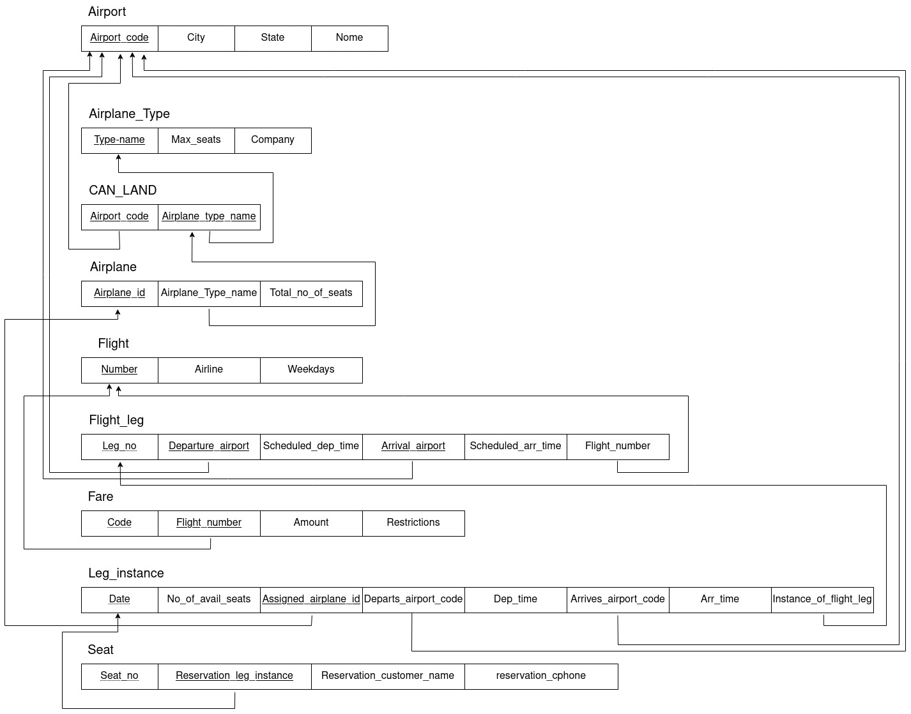

# BD: Guião 3


## ​Problema 3.1
 
### *a)*

```
Cliente: nome, endereço, num_curta, NIF
Aluguer: numero, duracao, data, balcao_numero, cliente_NIF, veiculo_matricula
Balcao: numero, nome, endereço
Veiculo: matricula, marca, ano, tipo_codigo
Tipo_veiculo: codigo, arcondicionado, designacao
Similaridade: codigo1,codigo2
Ligeiro: tipo_codigo, numlugares, portas, combustivel
Pesado: tipo_codigo, peso, passageiros
```


### *b)* 


| Tabela | Chaves Candidatas | Chaves Primárias | Chaves Estrangeiras |
| - | -| - | - |
| **Cliente** | NIF, num_carta | NIF | _______________ |
| **Aluguer** | numero | numero | cliente_NIF <br> balcao_numero <br> veiculo_matricula |
| **Balcao** | numero, endereço | numero | _______________ |
| **Veiculo** | matricula | matricula | tipo_codigo |
| **Tipo_veiculo** | codigo | codigo | _______________ |
| **Similaridade** | codigo1 <br> + codigo2 | codigo1 <br> + codigo2 | Tipoveiculo_codigo1 <br> + Tipoveiculo_codigo2|
| **Ligeiro** | tipo_codigo | tipo_codigo | tipo_codigo |
| **Pesado** | tipo_codigo | tipo_codigo | tipo_codigo |


### *c)* 


## ​Problema 3.2

### *a)*

```
Airport: airport_code, city, state, name

Flight_leg: leg_no, flight_number, departure_airport_code, arr_time, arrival_airport_code, dep_time

Flight: number, airline, weekdays

Fare: code, amount, restrictions, flight_number

Airplane: airplane_id, total_no_of_seats, type_name

Airplane_type: type_name, max_seats, company

Can_land: type_name, airport_code

Seat: seat_no, customer_name, cphone, date, leg_no, flight_number

Leg_instance: no_avail_seats, date,leg_no,flight_number ,airplane_id, arr_time, dep_time, departure_airport_code, arrival_airport_code

```


### *b)* 


| Tabela | Chaves Candidatas | Chaves Primárias | Chaves Estrangeiras |
| - | - | - | - |
| **Airport** | airport_code | airport_code | _______________ |
| **Flight_leg** | leg_no <br>+ flight_number | leg_no <br>+ flight_number | flight_number <br> departure_airport_code <br> arrival_airport_code|
| **Flight** | number | number| _______________ |
| **Fare** | code <br>+ flight_number | code <br>+ flight_number | flight_number |
| **Airplane** | airplane_id | airplane_id | type_name |
| **Airplane_type** | type_name | type_name | _______________ |
| **Can_land** | type_name <br>+ airport_code | type_name <br>+ airport_code | type_name <br> airport_code|
| **Seat** | seat_no <br>+ date <br>+ leg_no <br>+ flight_number | seat_no <br>+ date <br>+ leg_no <br>+ flight_number | date <br> leg_no <br> flight_number <br> |
| **Leg_instance** | date <br>+leg_no <br>+ flight_number | date <br>+leg_no <br>+flight_number| leg_no <br> flight_number <br> airplane_id <br> departure_airport_code <br> arrival_airport_code|


### *c)* 




## ​Problema 3.3


### *a)* 2.1


### *b)* 2.2


### *c)* 2.3


### *d)* 2.4

